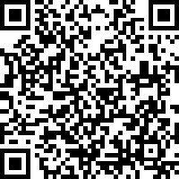

```{r setup, include=FALSE}
options(htmltools.dir.version = FALSE)
options(knitr.kable.NA="")
knitr::opts_chunk$set(fig.path="extra/",echo=FALSE,warning=FALSE,message=FALSE,cache=TRUE)
```

class: middle
background-image: url(extra/Rlogo.png)
background-size: auto 65%
background-position: 50% 50%

# R for Antarctic and Southern Ocean Science

- context and rOpenSci (Ben)
- modern state of R (Mike)
- some of our stuff (Ben, Mike)
- the biodiversity.aq Antarctic virtual research environment (Anton)
- general chat



---
background-image: url(extra/logos_footer.png)
background-size: auto 10%
background-position: 98% 98%

# rOpenSci 

rOpenSci: R for reproducible science, open data & software

https://ropensci.org/community/

Tutorials, use cases, discussion forum, open calls, physical meetings

For R developers/regular users:

- slack: http://slack.ropensci.org/
- package onboarding

SCAR/rOpenSci joint initiative


---
background-image: url(extra/logos_footer.png)
background-size: auto 10%
background-position: 98% 98%

# Antarctic/SO R packages

See https://github.com/SCAR/antarctic-r-packages

- taxonomy
- mapping
- environmental data access
- ocean colour processing
- biodiversity, diet data
- animal tracking

What packages do we need? What tasks/analyses should be easier than they currently are?

SCAR's github: https://github.com/SCAR

---
background-image: url(extra/logos_footer.png)
background-size: auto 10%
background-position: 98% 98%

# <u>blueant</u>/raadtools

https://github.com/AustralianAntarcticDivision/blueant

- pre-configured definitions for environmental/satellite data sets
- functions for maintaining local copies of those data

```{r eval=FALSE, echo=TRUE}
library(blueant)

## define where we want to store our data
my_data_dir <- "c:/my/big/data/collection"
cf <- bb_config(local_file_root=my_data_dir)

## add a few data sets to our configuration
my_sources <- c("NSIDC SMMR-SSM/I Nasateam sea ice concentration",
                "IBCSO bathymetry")

cf <- cf %>% bb_add(sources(my_sources))

## go!
bb_sync(cf)
```

---
background-image: url(extra/logos_footer.png)
background-size: auto 10%
background-position: 98% 98%

# <u>blueant</u>/raadtools

https://github.com/AustralianAntarcticDivision/blueant

- central data collection for multiple researchers

- scheduled task to keep it updated

- together with `raadtools` and virtual machine capability provides a consistent, community-level framework

---
background-image: url(extra/logos_footer.png)
background-size: auto 10%
background-position: 98% 98%

# blueant/<u>raadtools</u>

- functions for reading and manipulating environmental data in a simple and consistent way

https://github.com/AustralianAntarcticDivision/raadtools

```{r eval=FALSE, echo=TRUE}
library(raadtools)

```

